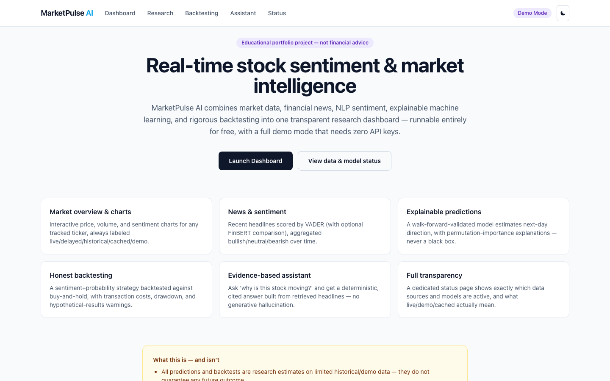
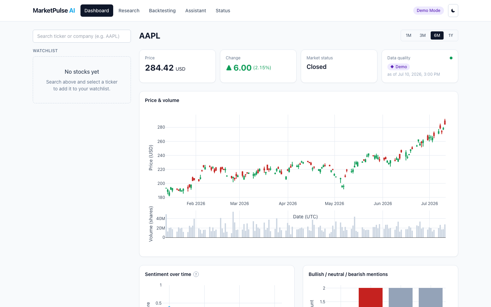
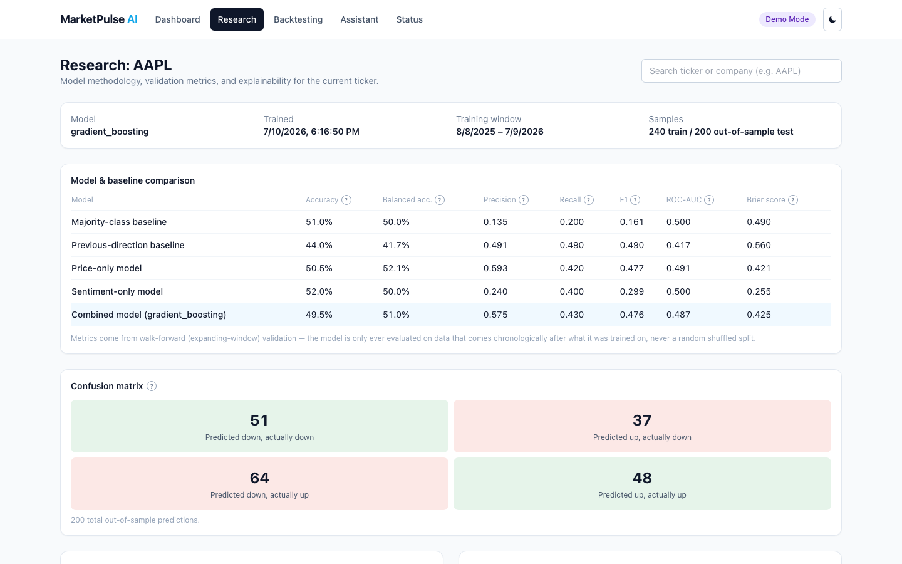
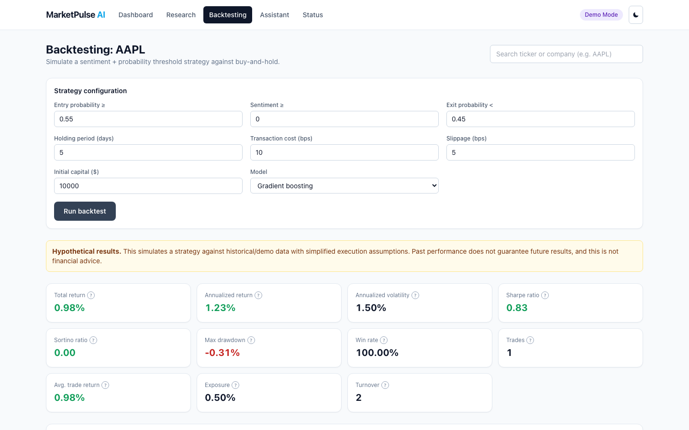
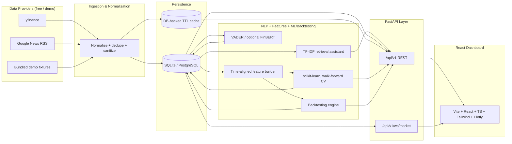

# MarketPulse AI

**Real-Time Stock Sentiment and Market Intelligence Platform**

> Portfolio project. 






*(Captured from a live local run in demo mode. Regenerate anytime with both dev
servers running: `npx playwright screenshot http://localhost:5173/dashboard
docs/screenshots/dashboard.png` from `frontend/`, or see `e2e/smoke.spec.ts` for
a scripted walkthrough.)*

## What this is

MarketPulse AI is a full-stack platform that pulls together market data, financial
news, NLP sentiment scoring, explainable machine learning, and rigorous
walk-forward backtesting into one transparent research dashboard. It runs entirely
for free with no paid APIs, no paid cloud, no OpenAI key and ships a complete
**demo mode** so it can be explored end to end with zero configuration and zero
API keys. Every piece of data displayed is explicitly labeled `live`, `delayed`,
`historical`, `cached`, or `demo`, so nothing is ever presented as something it
isn't.

## Features

- **Stock search & watchlist** — debounced ticker/company search, anonymous
  browser-persisted watchlist (no account required).
- **Market overview & charts** — interactive candlestick + volume charts, always
  data-status labeled.
- **News & sentiment** — deduplicated, sanitized headlines scored by VADER (with
  optional FinBERT comparison), aggregated bullish/neutral/bearish over time,
  source/model comparison table.
- **Event detection** — transparent, keyword-based detection of earnings,
  guidance, M&A, litigation, executive changes, analyst actions, dividends,
  splits, and macro headlines — never presented as causal proof.
- **Explainable ML predictions** — a walk-forward-validated logistic
  regression/gradient-boosting model estimates next-day direction, with
  permutation-importance (and optional SHAP) explanations, calibrated
  probabilities, and honest baseline comparisons shown alongside every metric.
- **Rigorous backtesting** — a configurable sentiment+probability strategy
  backtested against buy-and-hold with transaction costs, slippage, no
  look-ahead, and a full metrics/equity/drawdown/trade breakdown, always labeled
  hypothetical.
- **Model leaderboard** — compares walk-forward-validated model quality across
  tickers in one view, honestly flagging whether each one actually beats its
  baselines.
- **Confidence-threshold sweep** — runs the identical backtest strategy at
  several confidence thresholds against the same out-of-sample signal, to test
  whether trading only on high-confidence signals actually improves risk-adjusted
  returns (see "Interview talking points" for what this actually showed).
- **Evidence-based market assistant** — ask "why is this stock moving?" and get a
  deterministic, cited answer built from retrieved stored headlines/events — no
  generative LLM, so it cannot hallucinate a citation.
- **Real-time-ish updates** — a WebSocket pushes quotes on a configurable polling
  interval (not fake sub-second ticks), with reconnect/backoff and heartbeat.
- **Full transparency** — a dedicated status page shows exactly which providers
  and models are active right now.

## Architecture



Full design rationale: [`docs/architecture.md`](docs/architecture.md).

## Technology stack

**Frontend**: React 18, TypeScript, Vite, Tailwind CSS, Plotly.js, React Router,
TanStack Query, native WebSocket, Vitest + React Testing Library, Playwright.

**Backend**: Python 3.11, FastAPI, Uvicorn, Pydantic v2, SQLAlchemy 2.0, Alembic,
HTTPX, pandas, NumPy, scikit-learn, VADER (+ optional FinBERT/Transformers/PyTorch,
+ optional SHAP), pytest.

**Data/storage**: SQLite by default; `DATABASE_URL` swaps to PostgreSQL with no
code changes. Optional Redis cache; DB-backed TTL cache otherwise.

**DevOps**: Docker, Docker Compose, GitHub Actions, Makefile.

## Quick start

### Prerequisites

- Python 3.11+
- Node.js 20+
- (Optional) Docker + Docker Compose

> If your machine's package manager only offers a much newer Python (this
> project was built on a host stuck with Python 3.14, which lacks reliable
> wheels for numpy/pandas/scikit-learn) or lacks Node entirely, a Python 3.11 +
> Node 20 `conda`/`miniforge` environment is a fast, prebuilt-binary alternative
> to a slow from-source Homebrew install — that's exactly what this repo's own
> reference environment used.

### One-command demo startup

```bash
make setup   # creates backend/.venv, installs deps, npm install, copies .env
make demo    # DEMO_MODE=true — starts both servers, needs zero API keys
```

- Backend: http://localhost:8000 (interactive docs at `/docs`)
- Frontend: http://localhost:5173

### Manual startup (no Makefile)

```bash
# Backend
cd backend
python3.11 -m venv .venv && source .venv/bin/activate
pip install -r requirements.txt -r requirements-dev.txt
cp ../.env.example .env   # DEMO_MODE=true by default
alembic upgrade head
uvicorn app.main:app --reload --port 8000

# Frontend (separate terminal)
cd frontend
npm install
npm run dev
```

### Via Docker Compose

```bash
docker compose up --build
# backend:  http://localhost:8000
# frontend: http://localhost:8080
```

See [`docs/deployment.md`](docs/deployment.md) for a note on how this was
verified (native venv/npm, since the build host had no local Docker engine) and
for free-tier hosting instructions.

## Environment variables

See [`.env.example`](.env.example) for the full, commented list. The essentials:

| Variable | Default | Purpose |
|---|---|---|
| `DEMO_MODE` | `true` | Zero-config demo mode, no API keys or network needed |
| `DATABASE_URL` | `sqlite:///./marketpulse.db` | Swap for Postgres DSN with no code changes |
| `REDIS_URL` | *(empty)* | Optional; DB-backed TTL cache used otherwise |
| `CORS_ORIGINS` | `localhost:5173` | Frontend origin(s) allowed to call the API |
| `ENABLE_FINBERT` | `false` | Optional finance-tuned sentiment model (heavy download) |
| `ENABLE_REDDIT` | `false` | Optional social sentiment (needs free Reddit app credentials) |
| `ENABLE_FRED` | `false` | Optional Buffett Indicator widget (needs free FRED API key) |
| `MARKET_POLL_INTERVAL_SECONDS` | `15` | WebSocket push cadence |
| `VITE_API_BASE_URL` / `VITE_WS_BASE_URL` | `localhost:8000` | Frontend → backend URLs |

## Data sources

yfinance (free, unofficial, delayed) for market data; Google News RSS (free, no
key) for headlines; optional Reddit (needs free user-supplied credentials) for
social sentiment; bundled synthetic fixtures for demo mode. Full disclosure of
what each source actually is, its limitations, and how fallback works:
[`docs/data-sources.md`](docs/data-sources.md).

## Model methodology

Time-aligned feature engineering (price + sentiment + event indicators),
walk-forward (expanding-window) validation, logistic regression / gradient
boosting, temporal Platt-scaling calibration, permutation importance (+ optional
SHAP), and an honest comparison against majority-class, previous-direction,
price-only, and sentiment-only baselines on every request. Full write-up
including a real calibration bug found and fixed during development:
[`docs/model-card.md`](docs/model-card.md).

## Backtesting methodology

A configurable sentiment+probability threshold strategy, backtested with
transaction costs and slippage against buy-and-hold, using the same no-look-ahead
walk-forward signal as the research pipeline. Full methodology:
[`docs/backtesting-methodology.md`](docs/backtesting-methodology.md).

## Testing

```bash
# Backend: 96 tests, 89% coverage
cd backend && pytest -q --cov=app --cov-report=term-missing

# Frontend: 19 tests (Vitest + React Testing Library)
cd frontend && npm run test

# End-to-end (Playwright) — requires both dev servers already running
cd frontend && npm run test:e2e

# Lint / format / type-check
make lint      # ruff + mypy (backend), eslint (frontend)
make format    # black + ruff --fix (backend), prettier (frontend)
```

Or simply `make test` / `make lint` / `make format` from the repo root.

## Deployment

Docker images and free-tier hosting notes (Render/Fly-style backend,
Vercel/Netlify-style static frontend) in
[`docs/deployment.md`](docs/deployment.md). Core application logic has no
platform-specific code — everything platform-specific lives in Dockerfiles,
compose config, and that doc.

## Known limitations

- Demo-ticker price history is **synthetic** (seeded random walk), clearly
  labeled — not real historical prices. Real tickers use real yfinance data when
  `DEMO_MODE=false` and network access is available.
- "Real-time" means a polling interval suited to free data sources (default 15s),
  never sub-second ticks.
- ML/backtest results reflect a small feature set and limited history; they are
  research estimates, not production trading signals, and performance varies
  significantly by ticker and period (see the Research page's baseline
  comparison before trusting any single number).
- Docker Compose setup was authored to spec but not exercised on the build host
  (no local Docker engine there); native venv/npm was the verified local path.
- Rate limiting is in-memory per process — fine for a single instance, not
  multi-instance-consistent without an added shared store.

## Ethical & financial disclaimer

This project is for educational and portfolio purposes only. It is **not**
financial advice, and no prediction, backtest, or sentiment score should be used
as the sole basis for a real investment decision. No model here — or arguably any
model built on comparably limited data — can guarantee future returns. Historical
and demo backtest results are hypothetical and do not represent actual trading.

## Future improvements

- Add a real message queue for sentiment scoring so ingestion never blocks a
  request thread, even under heavier load than a demo needs.
- Expand event detection with a lightweight trained classifier alongside the
  transparent keyword baseline, keeping both visible for comparison.
- Portfolio-level backtesting (multiple tickers, position sizing, correlation).
- A lightweight local LLM as an optional (never required) upgrade path for the
  market assistant's phrasing, still constrained to only cite retrieved evidence.

## Resume bullets

- Built a full-stack financial ML platform (React/TypeScript + FastAPI/Python)
  combining real-time-ish market data, NLP sentiment (VADER/FinBERT), and
  explainable ML predictions with honest walk-forward validation.
- Designed a leakage-free feature pipeline and walk-forward backtesting engine
  for a sentiment-driven trading strategy, including transaction-cost modeling
  and benchmark comparison against buy-and-hold.
- Found and fixed a subtle probability-calibration bug where a model's own
  training-set confidence was being mistaken for generalization performance,
  and added a regression test to prevent recurrence.
- Implemented a retrieval-based (TF-IDF), citation-grounded Q&A assistant that
  cannot hallucinate sources, as a free alternative to a generative-LLM integration.
- Shipped a complete zero-API-key demo mode with synthetic-but-labeled fixture
  data, enabling full feature evaluation without any credentials or paid services.
- Built a cross-ticker model leaderboard and a confidence-threshold sweep for the
  backtesting engine — then ran it against real data and reported the honest,
  mixed finding (a stricter confidence gate doesn't reliably improve risk-adjusted
  returns for this model) rather than only shipping the feature that would look good.
- Found and fixed a real timezone bug (`pd.DatetimeIndex` rejecting a list of
  live-market timestamps spanning a DST transition) and a real concurrency bug (a
  check-then-insert race on cached price bars) — both surfaced only once the app
  was exercised against real, non-demo market data for long enough.

## Interview talking points

- **Why walk-forward validation, not train_test_split?** Random splits leak
  future information into the past for time series; a model that "sees" tomorrow
  during training will look artificially good and fail live. Explained in depth
  in `docs/model-card.md`.
- **Tell me about a bug you found.** The production model's calibrator was fit on
  its own training data, producing 97% confidence on what was actually a
  coin-flip-accuracy model — because gradient boosting can trivially memorize its
  training rows. Fixed by calibrating on a genuinely held-out later slice. See the
  "Bug caught and fixed" section of `PLAN.md` and `docs/model-card.md`.
- **How do you avoid hallucination in the assistant without an LLM?** TF-IDF +
  cosine similarity ranks already-stored rows; a small set of templates fills in
  the answer. It can literally only ever quote text that exists in the database —
  there's no generation step that could invent a citation.
- **How does demo mode stay "fresh" forever?** Fixtures store relative offsets
  (trading-days-ago, hours-ago), not baked-in dates; the demo provider resolves
  them to real timestamps at request time.
- **What would you change with more time?** See "Future improvements" above —
  particularly portfolio-level backtesting.
- **Does trading only on high-confidence signals actually work better?** Not
  reliably, for this model — see the "Confidence-threshold sweep" section of
  `docs/backtesting-methodology.md`. Across the bundled tickers, the calibrated
  probabilities cluster near the extremes rather than spreading smoothly, so the
  threshold mostly acts as a blunt on/off filter rather than a quality dial, and
  in one case (GME) filtering to only the highest-confidence trades made the
  Sharpe ratio *worse*. Reported as a real, honest finding rather than hidden.

## Five-minute recruiter demo script

1. **Landing page** (30s) — value prop, feature highlights, explicit "not
   financial advice" framing.
2. **Dashboard** (90s) — search/select a ticker (try switching between AAPL and
   GME to see contrasting bullish vs. bearish sentiment), point out the
   data-status badges, price/volume chart, sentiment timeline, and the
   Prediction Card's probability + feature importance.
3. **Research page** (60s) — show the baseline comparison table (the model
   doesn't always beat a coin flip — that's the honest point) and the confusion
   matrix.
4. **Backtesting page** (60s) — run the default strategy, show the equity curve
   vs. buy-and-hold, the hypothetical-results disclaimer, and the trade table.
5. **Assistant page** (30s) — click a suggested question ("Why is this stock
   moving?"), point out the citations linking back to real stored headlines.
6. **Status page** (30s) — show exactly which providers/models are active,
   tying back to the "no fabricated data" promise from the landing page.

## Files to read first (for a new contributor)

1. `docs/architecture.md` — system design and the "why" behind key decisions.
2. `backend/app/main.py` → `backend/app/api/v1/__init__.py` — how the API is wired.
3. `backend/app/ml/features.py` and `backend/app/ml/pipeline.py` — the
   leakage-prevention and walk-forward validation logic (the technical core).
4. `backend/app/backtesting/engine.py` — the backtest simulation loop.
5. `frontend/src/App.tsx` and `frontend/src/pages/DashboardPage.tsx` — how the
   frontend is routed and composed.
